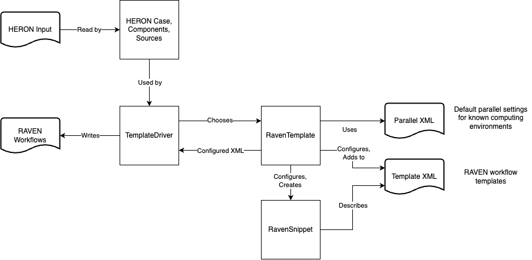

# The HERON Template Driver: A Guide for the HERON Developer

The HERON template driver is the portion of HERON which constructs RAVEN workflows given the information provided in the HERON input file.
In HERON, a template consists of an XML file which outlines a RAVEN workflow and a Python class which configures that workflow with the provided case information.
The template driver determines which template is most appropriate for each case.
The goal of this guide to explain the design philosophy of the template driver and give guidance on how it should be modified when adding features to HERON.
An illustrative diagram of the major object types and their interactions is given in the figure below.

The current template system was developed with a few guiding principles in mind:
1. XML nodes in the template XML should never be removed by the template's Python class. If a node is present in the XML, you can count in being able to access it anywhere in the template class.
2. Subclasses of `RavenSnippet` should handle all XML operations within the block of XML described by the snippet class. Subclasses of `RavenTemplate` should handle orchestrating the connections among these snippets.
3. Use a flat workflow whenever possible. While any valid HERON case can be run with the bilevel template, the overhead of starting a new instance of RAVEN for each inner workflow iteration can add significantly slow down analyses.

Also, if you're editing anything in the template drivers:
- Use type hints THOROUGHLY
- Favor properties over getter/setter methods

## Templates
There are currently three main "flavors" of templates in the HERON templating system:
- Bilevel templates: workflows with an outer workflow for varying system capacity and economic variables and an inner workflow for evaluating the system dispatch over multiple time histories. The bilevel templates are further broken down by case mode ("opt" or "sweep") and time history source (sythetic or static).
- "Flat" templates: workflows which can be collapsed to either an inner or outer workflow.
- Debug template: a special template for HERON's "debug" mode.

## Flat Template Limitations
Some cases which mathematically could be flat workflows cannot currently be implemented as such due to implementation issues in RAVEN or HERON.
- "opt" mode workflows with a single time history. The limitation is the RAVEN MultiRun step accepts either an Optimizer or a Sampler, but not both. To sample the time history (static or synthetic) requires the use of a sampler in the MultiRun step.
- Some workflows with uncertain economic parameters could be flat workflows, but the cashflows they describe are quantified in the HERON dispatch manager. There is currently no way to sample an uncertain economic parameter without running the dispatch optimization.

## Should I make a new template?
The templating system is designed to make creating new templates a somewhat easy task.
However, a balance must be struct between configuring existing templates and creating new templates.
When is it appropriate to make a new template?

Don't make a new template if...
- Substituting one algorithm for another (e.g. Bayesian optimization vs. gradient descent for optimization)
- Exposing options for an algorithm or entity that is already used by one or more templates

Make a new template if...
- Adding significant new functionality, like new workflow types or new HERON case modes
- There is little overlap between the desired workflow and existing templates
- Adding a feature affects many parts of the template XML

The final decision is left to the best judgement of the developer.
However, creating a new template likely represents a signficant development effort and would benefit from consultation with the core HERON development team.

## So you want to...
An approximate guide on steps to take to implement new features.

### Expose an existing RAVEN feature to the HERON user
1. Create a new RavenSnippet subclass for the feature if one does not yet exist. Expose subelement and attribute options as class properties.
2. Add unit tests for the snippet class.
3. Determine which templates can make use of the feature. If using the feature would require removing a node from the template XML, the template node should be removed and the feature should be added to the workflow from the python class.

### Add a new HERON case mode
1. If the case mode will be run as a bilevel workflow, a new template file and class will likely need to be made for the bilevel outer template (currently split out by different modes).
2. If some cases of the mode could be run as a flat template, implement that as appropriate. This could be modifying the existing `FlatMultiConfigTemplate` template or creating a new template. Add this new template to the `TemplateDriver` as appropriate.

### Make new kind of workflow
1. A new template very likely needs to be made. Create one or more template XML files and their corresponding `RavenTemplate` classes to configure them.
2. Consider which features of the workflow are useful in the other templates. Refactor as necessary.
3. Add these templates to the `TemplateDriver`.
